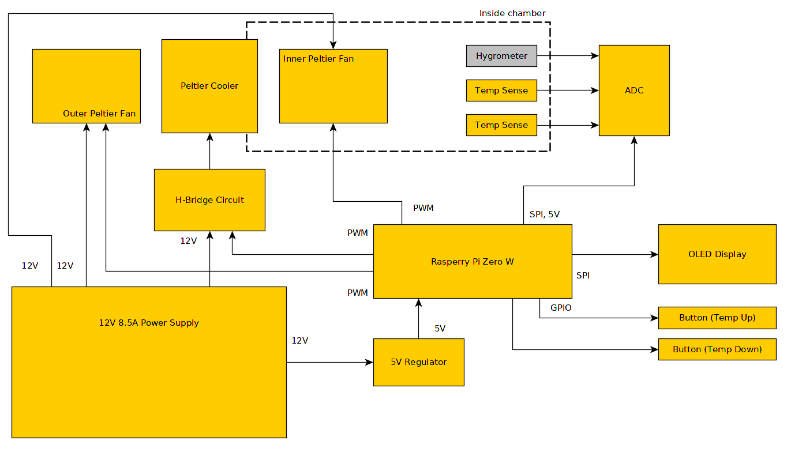

# chamber

Kitchen countertop thermal chamber used for longer duration culinary
processes that require precise temperature control such as sourdough
starter care, pickling, and others.

This project was accepted as a demo presentation at the 2019 Hackaday
Superconference! Hackaday wrote a really nice article about the project
too: [Engineering Your Way To Better Sourdough (and Other Fermented Goods)](https://hackaday.com/2020/01/08/engineering-your-way-to-better-sourdough-and-other-fermented-goods/)

## Setup

### Purchasing Materials

BOM: [Chamber BOM](https://docs.google.com/spreadsheets/d/1ZfumkMcpwunLCNRvsuWQJhhpWst-3aOSHlbOKffAX_0/edit?usp=sharing)

### Software Requirements

- [ArduiPi_OLED](https://github.com/hallard/ArduiPi_OLED) for interacting with the Arduino OLED
- [pigpio](https://github.com/joan2937/pigpio)

### Python venv

For test scripts of individual components

```sh
chamber@chamber-pi:~/chamber $ source chamber-venv/bin/activate
(chamber-venv) chamber@chamber-pi:~/chamber $
```

### SPI Support

1. `sudo raspi-config`
2. Select interfaces
3. Select SPI
4. Enable

### 1-Wire Support

#### Enable on Specific GPIO

1. `sudo vi /boot/firmware/config.txt`
2. Add the following to the end of the file:
    ```shell
    dtoverlay=w1-gpio,gpiopin=22
    ```
3. Reboot the pi: `sudo reboot`

#### Load Kernel Modules

1. `sudo modprobe w1-gpio`
2. `sudo modprobe w1-therm`

## Roadmap

- Switch controlled interior lights
- Custom PCB to reduce cost and clean up look (maybe a RPi hat!)
- Mechanical design improvements: hinged door, stackable, insulation

## Hardware Block Diagram



## Considerations

- DS18B20 CPP Code shamelessly copy/pasted from [DS18B20_cpp](https://github.com/nilshenrich/DS18B20_cpp/tree/main)

